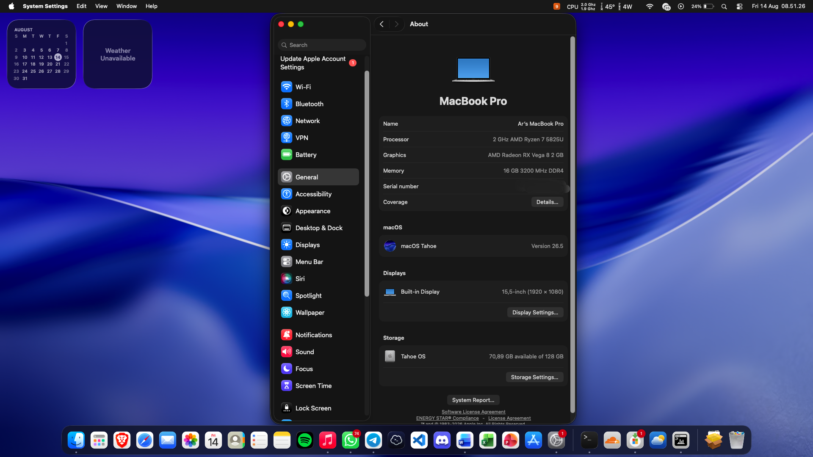

# OpenCore EFI — Infinix XBOOK 15 BL51A5

OpenCore EFI untuk **Infinix XBOOK 15 BL51A5** dengan AMD Ryzen 7 5825U dan iGPU Radeon Vega 8.

Snapshot ini diekspor dari EFI yang dipakai harian pada **14 Agustus 2026**. Konfigurasi ini stabil untuk penggunaan harian pada macOS Tahoe 26.5; keterbatasan yang masih terasa terutama berupa artifact sesekali pada aplikasi Electron/Chromium. Semua identitas SMBIOS di repo sudah diganti dengan placeholder.



## Dukungan macOS

| Versi | Status | Catatan |
|---|---|---|
| macOS Tahoe 26.5 | ✅ Diuji langsung | Sistem utama saat snapshot dibuat |
| macOS Sequoia 15.7 | ✅ Pernah diuji | ACPI, kernel patch, dan susunan kext yang sama; lakukan backup sebelum berpindah versi |
| Sonoma dan lebih lama | ⚠️ Tidak menjadi target snapshot | Mungkin bisa boot, tetapi tidak diuji dengan config ini |

Config OpenCore ini tidak dikunci khusus ke Tahoe. Kernel patch AMD, ACPI, dan kext utamanya dapat dipakai di **Tahoe maupun Sequoia**. Namun, update macOS atau kext tetap dapat mengubah kompatibilitas.

## Hardware

| Komponen | Detail |
|---|---|
| Model | Infinix XBOOK 15 / BL51A5 |
| Motherboard | `EM_AB336_MB_CY_V1.0` |
| BIOS teruji | `BL51A5_AB336_XBOOK15_V1.10` |
| CPU | AMD Ryzen 7 5825U, 8 core / 16 thread |
| iGPU | AMD Radeon Vega 8 / Barcelo, `1002:15e7` |
| RAM saat pengujian | 16 GB DDR4-3200 |
| Storage | NVMe SSD |
| Wi-Fi | Realtek RTL8821CE PCIe, `10ec:c821` |
| Bluetooth | Realtek RTL8821C USB, `0bda:c821` |
| Ethernet | Realtek RTL8111/8168 |
| Audio | Realtek ALC269VC, layout-id 55 |
| Trackpad | I2C HID melalui VoodooI2C/VoodooI2CHID |
| SMBIOS | MacBookPro16,2 |

## Status fitur

| Fitur | Status | Catatan |
|---|---|---|
| OpenCore picker dan boot macOS | ✅ Bekerja | Tahoe 26.5 diuji sebagai sistem utama |
| CPU 8C/16T | ✅ Bekerja | Kernel patch AMD + ForgedInvariant |
| CPU power management | ✅ Bekerja | AMDRyzenCPUPowerManagement, SMCAMDProcessor, dan SSDT-CPUR |
| iGPU Vega 8 + Metal | ✅ Stabil untuk penggunaan harian | NootedRed memberi akselerasi; artifact sesekali masih dapat muncul pada aplikasi Electron/Chromium |
| Internal display | ✅ Bekerja | Termasuk backlight |
| Keyboard | ✅ Bekerja | VoodooPS2Controller |
| Trackpad I2C | ✅ Bekerja | VoodooI2C + VoodooI2CHID; gesture tertentu dapat berbeda |
| Brightness keys | ✅ Bekerja | BrightnessKeys |
| Battery status | ✅ Bekerja | SMCBatteryManager |
| NVMe | ✅ Bekerja | NVMeFix aktif |
| Ethernet | ✅ Driver aktif | RealtekRTL8111 |
| Wi-Fi RTL8821CE | ✅ Bekerja lewat Starskiff | Tidak tampil sebagai AirPort/CoreWLAN native |
| Wi-Fi lewat System Settings | ❌ Tidak bekerja | `rtw88` memublikasikan interface Ethernet; gunakan Starskiff |
| Bluetooth Realtek | ✅ Bekerja pada unit pengujian | RealtekBluetoothFirmware + BlueToolFixup |
| AirDrop / AWDL / Continuity penuh | ❌ Tidak bekerja | RTL8821CE bukan kartu AirPort dan driver tidak menyediakan AWDL |
| Audio | ✅ Bekerja | AppleALC setelah NootedRed, layout-id 55 |
| Sleep/wake | ✅ Bekerja pada unit pengujian | Tetap uji setelah mengubah USB mapping, Bluetooth, atau versi macOS |
| DRM / streaming protected content | ⚠️ Tidak dijamin | `unfairgva=1` sengaja dihapus karena tidak memperbaiki reset GPU |

## Batasan grafis NootedRed

EFI ini memakai **NootedRed 0.9.0 RELEASE artifact** yang dibangun pada 1 Agustus 2026 dengan macOS 26.5 SDK. Binary ini sama dengan yang dipakai pada snapshot stabil 14 Agustus 2026 dan terasa lebih baik daripada 0.8.10 pada unit pengujian, tetapi belum menghilangkan semua masalah grafis.

Gejala pada build sebelumnya yang pernah terkonfirmasi melalui laporan `.gpuRestart`:

- Safari/WebKit dapat tersendat atau reset saat memutar video.
- App Store dan `mediaanalysisd` juga dapat memicu reset pada shader `VTMTSComputeFunction`.
- Menambah UMA dari 512 MB ke 1 GB membantu ruang grafis, tetapi tidak menyelesaikan bug driver.

Pada snapshot saat ini, Safari, App Store, dan fungsi harian lain berjalan stabil pada unit pengujian. Masalah tersisa yang terlihat adalah artifact sesekali pada aplikasi Chromium/Electron seperti Discord, Spotify, Termius, dan Brave ketika hardware acceleration aktif.

Workaround harian:

- Jalankan aplikasi Electron bermasalah dengan `--disable-gpu`.
- Matikan graphics acceleration pada browser jika stabilitas lebih penting.
- Gunakan wallpaper solid bila wallpaper dinamis memicu reset.
- Jalankan `Extras/fix-nootedred.sh` setelah fresh install jika desktop/login mengalami hang.
- Dengan RAM 16 GB, UMA 2 GB dapat dicoba. Gunakan 1 GB bila ingin menyisakan lebih banyak RAM untuk sistem.

Boot arguments snapshot ini:

```text
revcpu=1 -NRedDPDelay
```

`unfairgva=1` sudah dihapus setelah pengujian karena tidak memperbaiki masalah video dan GPU reset.

## Wi-Fi dan Bluetooth

RTL8821CE tidak dikenali sebagai Wi-Fi native oleh CoreWLAN. Driver `rtw88.kext` membuat interface `en0` bertipe Ethernet dan **Starskiff** berkomunikasi langsung dengan user-client driver.

Komponen:

| Peran | Komponen |
|---|---|
| Driver Wi-Fi | `rtw88.kext` |
| UI Wi-Fi | Starskiff |
| Firmware Bluetooth | `RealtekBluetoothFirmware.kext` |
| Patch Bluetooth Monterey+ | `BlueToolFixup.kext` |

Setelah instalasi:

1. Install Starskiff dari `Extras/Starskiff-v1.0.0.dmg` atau gunakan rilis yang lebih baru.
2. Tambahkan Starskiff ke **System Settings → General → Login Items**.
3. Hubungkan Wi-Fi melalui ikon Starskiff, bukan menu Wi-Fi Apple.

AirDrop tidak dapat diperbaiki hanya dengan mengubah config. Untuk AirDrop dibutuhkan hardware dan driver dengan dukungan AWDL.

## BIOS

Gunakan pengaturan berikut:

| Setting | Nilai |
|---|---|
| Secure Boot | Disabled |
| Fast Boot | Disabled |
| CSM | Disabled |
| IOMMU | Disabled |
| Above 4G Decoding | Enabled |
| UMA Frame Buffer | 1 GB atau 2 GB untuk RAM 16 GB; snapshot diuji dengan 2 GB |

Jangan mengubah menu engineer/advanced yang tidak dipahami. Backup setting BIOS dan EFI sebelum eksperimen.

## Sebelum digunakan: buat SMBIOS sendiri

Repo publik ini **tidak berisi identitas mesin asli**. Nilai berikut adalah placeholder:

| Field | Placeholder |
|---|---|
| SystemSerialNumber | `XXXXXXXXXXXX` |
| MLB | `M0000000000000001` |
| SystemUUID | `00000000-0000-0000-0000-000000000000` |
| ROM | `11:22:33:44:55:66` |

Generate nilai unik menggunakan GenSMBIOS/macserial sebelum login ke iCloud. Jangan memakai serial dari repo orang lain dan jangan pernah commit identitas mesin pribadi.

## Instalasi singkat

1. Download atau clone repo ini.
2. Generate SMBIOS unik dan isi `EFI/OC/config.plist`.
3. Copy folder `EFI` ke partisi EFI USB untuk pengujian.
4. Boot dari USB terlebih dahulu.
5. Jika seluruh perangkat utama bekerja, backup EFI lama lalu copy EFI ini ke partisi internal.
6. Reset NVRAM hanya ketika memang diperlukan setelah perubahan config besar.

Untuk fresh install yang mengalami gray screen/hang, jalankan:

```bash
bash Extras/fix-nootedred.sh "Macintosh HD"
```

Sesuaikan nama volume target. Script sebaiknya dijalankan dari Recovery.

## Komponen utama snapshot

| Komponen | Versi |
|---|---|
| NootedRed | 0.9.0 RELEASE artifact, build 1 Agustus 2026 (macOS 26.5 SDK) |
| Lilu | 1.7.2 |
| VirtualSMC | 1.3.7 |
| AppleALC | 1.9.7 |
| RestrictEvents | 1.1.6 |
| RealtekRTL8111 | 3.0.4 |
| rtw88 | 1.0.1 |
| VoodooI2C | 2.9.1 |
| VoodooPS2Controller | 2.3.7 |
| AMDRyzenCPUPowerManagement | 0.7.2 |

NootedRed harus dimuat **sebelum AppleALC**. Satu instance VoodooInput dari VoodooI2C digunakan; plugin VoodooInput, Mouse, dan Trackpad milik VoodooPS2 dinonaktifkan untuk menghindari konflik.

## Struktur repo

```text
.
├── EFI
│   ├── BOOT
│   └── OC
│       ├── ACPI
│       ├── Drivers
│       ├── Kexts
│       ├── Resources
│       ├── config.plist
│       └── OpenCore.efi
├── Extras
├── BACKUP.md
├── SMBIOS.txt
└── SOURCES.txt
```

File backup/debug dari EFI harian sengaja tidak ikut dimasukkan.

## Sumber dan kredit

- [OpenCorePkg](https://github.com/acidanthera/OpenCorePkg)
- [NootedRed](https://github.com/ChefKissInc/NootedRed)
- [AMD Vanilla](https://github.com/AMD-OSX/AMD_Vanilla)
- [VoodooI2C](https://github.com/VoodooI2C/VoodooI2C)
- [OpenCore EFI Infinix XBOOK B15](https://github.com/kodeaqua/opencore-infinix-xbook-b15)
- [OpenCore EFI Axioo Hype 7 AMD](https://github.com/kodeaqua/opencore-axioo-hype7-amd-x7-2)
- FeiXiao/rtw88, Starskiff, dan RealtekBluetoothFirmware
- Acidanthera, ChefKissInc, AMD-OSX, Mieze, dan komunitas Hackintosh

## Disclaimer

Hackintosh tidak didukung Apple. Update macOS, BIOS, OpenCore, atau kext dapat menyebabkan gagal boot, kernel panic, kehilangan akselerasi, atau kehilangan data. Selalu simpan EFI bootable cadangan dan backup data sebelum melakukan perubahan.
