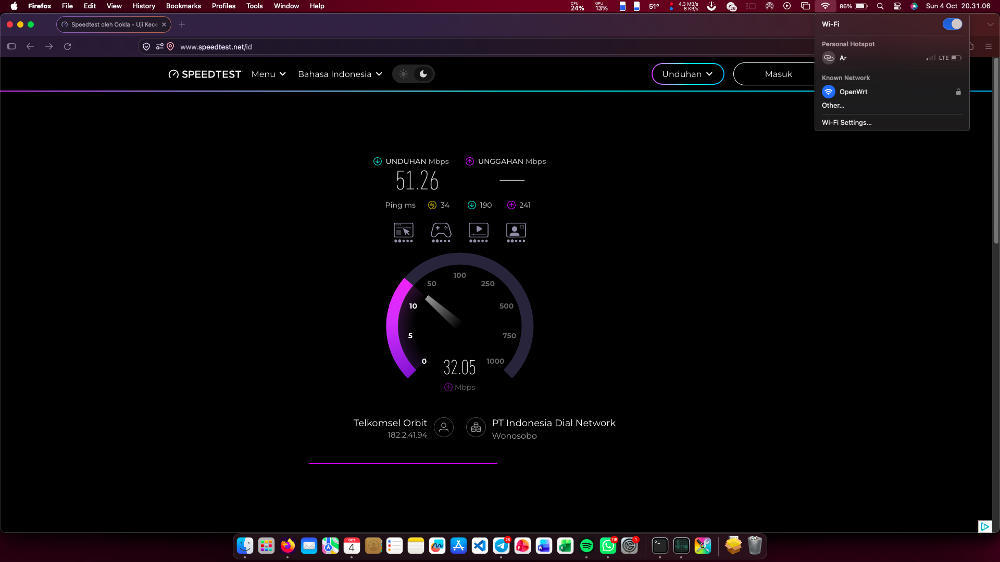
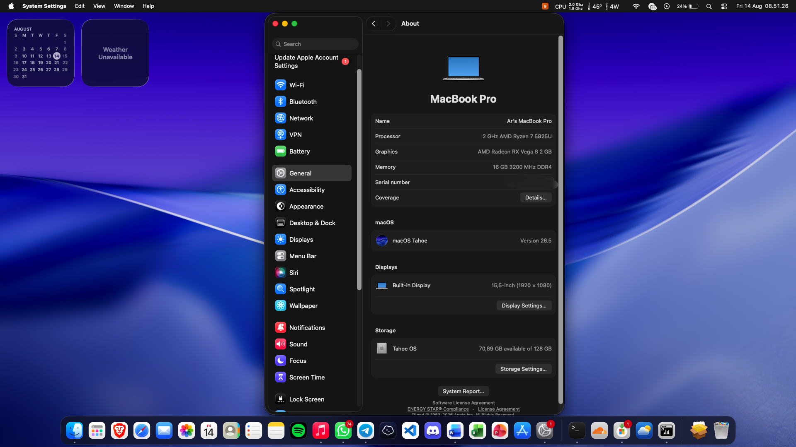

# OpenCore EFI — Infinix XBOOK 15 BL51A5

**English** | [Bahasa Indonesia](README_ID.md)

OpenCore EFI for the **Infinix XBOOK 15 BL51A5**, powered by an AMD Ryzen 7 5825U and Radeon Vega 8 integrated graphics.

This snapshot was exported from the active EFI on **October 4, 2026** and targets **macOS Sonoma 14.8.9 (23J631)**.





## macOS support

| Version | Status | Notes |
|---|---|---|
| macOS Sonoma 14.8.9 | ✅ Directly tested | Primary target of this snapshot |
| macOS Tahoe 26.5 | ✅ Previously tested | Previous repository snapshot used FeiXiao `rtw88` + Starskiff |
| macOS Sequoia 15.7 | ✅ Previously tested | Back up the EFI before switching versions |

This snapshot contains the Sonoma Legacy IO80211 stack for AirPortRTW. Do not assume that the same Wi-Fi configuration is suitable for newer macOS releases without testing from a USB EFI first.

## Hardware

| Component | Details |
|---|---|
| Model | Infinix XBOOK 15 / BL51A5 |
| Motherboard | `EM_AB336_MB_CY_V1.0` |
| Tested BIOS | `BL51A5_AB336_XBOOK15_V1.10` |
| CPU | AMD Ryzen 7 5825U, 8 cores / 16 threads |
| iGPU | AMD Radeon Vega 8 / Barcelo, `1002:15e7` |
| Tested memory | 16 GB DDR4-3200 |
| Storage | NVMe SSD |
| Wi-Fi | Realtek RTL8821CE PCIe, `10ec:c821` |
| Bluetooth | Realtek RTL8821C USB, `0bda:c821` |
| Ethernet | Realtek RTL8111/8168 |
| Audio | Realtek ALC269VC, layout-id 55 |
| Trackpad | I2C HID through VoodooI2C/VoodooI2CHID |
| SMBIOS | MacBookPro16,2 |

## Feature status

| Feature | Status | Notes |
|---|---|---|
| OpenCore picker and macOS boot | ✅ Working | Sonoma 14.8.9 tested as the primary system |
| CPU 8C/16T | ✅ Working | AMD kernel patches + ForgedInvariant |
| CPU power management | ✅ Working | AMDRyzenCPUPowerManagement, SMCAMDProcessor, and SSDT-CPUR |
| Vega 8 iGPU + Metal | ⚠️ Working with limitations | NootedRed provides acceleration; GPU resets or artifacts may occur in some applications |
| Internal display | ✅ Working | Includes backlight control |
| Keyboard | ✅ Working | VoodooPS2Controller |
| I2C trackpad | ✅ Working | VoodooI2C + VoodooI2CHID; individual gestures may vary |
| Brightness keys | ✅ Working | BrightnessKeys |
| Battery status | ✅ Working | SMCBatteryManager |
| NVMe | ✅ Working | NVMeFix enabled |
| Ethernet | ✅ Driver active | RealtekRTL8111 |
| RTL8821CE Wi-Fi | ✅ Working | Native Wi-Fi UI through AirPortRTW 1.0.1 (JoMei9019-real); 40–50+ Mbps throughput verified on Sonoma 14.8.9 |
| Wi-Fi recovery | ✅ Improved | AirPortRTW 1.0.1 features output queue gating (STA_R10/R11) and sleep NAPI synchronization |
| Realtek Bluetooth | ✅ Working on the tested unit | RealtekBluetoothFirmware + BlueToolFixup |
| Full AirDrop / AWDL / Continuity | ❌ Not reliable | AirPortRTW does not provide production-ready AWDL/Continuity support |
| Audio | ✅ Working | AppleALC after NootedRed, layout-id 55 |
| Sleep/wake | ✅ Working on the tested unit | Retest after changing the USB map, Bluetooth stack, or macOS version |
| DRM / protected streaming content | ⚠️ Not guaranteed | `unfairgva=1` was intentionally removed because it did not prevent GPU resets |

## NootedRed graphics limitations

This EFI currently uses **NootedRed 0.8.10**, matching the active Sonoma EFI. Graphics acceleration works on the tested unit, but NootedRed limitations can still vary by macOS version and workload.

Symptoms previously confirmed on older builds through `.gpuRestart` reports:

- Safari/WebKit could stutter or reset during video playback.
- App Store and `mediaanalysisd` could trigger resets in the `VTMTSComputeFunction` shader.
- Increasing UMA from 512 MB to 1 GB provided more graphics memory but did not solve the driver bug.

Graphics acceleration is available, but stability depends on the application and macOS build. GPU resets have previously been recorded, and Chromium/Electron applications such as Discord, Spotify, Termius, and Brave may show artifacts while hardware acceleration is enabled.

Daily-use workarounds:

- Launch affected Electron applications with `--disable-gpu`.
- Disable graphics acceleration in browsers when stability matters more than performance.
- Use a solid-color wallpaper if dynamic wallpapers trigger resets.
- Run `Extras/fix-nootedred.sh` after a fresh installation if the desktop or login screen hangs.
- With 16 GB of RAM, a 2 GB UMA allocation can be used. Choose 1 GB if you prefer to leave more memory available to macOS.

Snapshot boot arguments:

```text
revcpu=1 -NRedDPDelay
```

`unfairgva=1` was removed after testing because it did not resolve video issues or GPU resets.

## Wi-Fi and Bluetooth

On Sonoma, this snapshot uses AirPortRTW (JoMei9019-real) with the Legacy IO80211 stack so RTL8821CE appears in Apple's native Wi-Fi interface. `AirPort_RTW88.kext` and the older FeiXiao `rtw88.kext` remain in the EFI as disabled fallbacks and must not be enabled at the same time.

Components:

| Role | Component |
|---|---|
| Wi-Fi driver | `AirPortRTW.kext` 1.0.1 (JoMei9019-real) |
| Compatibility stack | `AMFIPass.kext`, `IOSkywalkFamily.kext`, `IO80211FamilyLegacy.kext` |
| Disabled fallback | `AirPort_RTW88.kext` 2.0.0, FeiXiao `rtw88.kext` 1.0.1 + Starskiff |
| Bluetooth firmware | `RealtekBluetoothFirmware.kext` |
| Bluetooth patch for Monterey and newer | `BlueToolFixup.kext` |

AirDrop cannot be made reliable through configuration changes alone. It requires working AWDL support in both hardware and driver.

## BIOS

Use the following settings:

| Setting | Value |
|---|---|
| Secure Boot | Disabled |
| Fast Boot | Disabled |
| CSM | Disabled |
| IOMMU | Disabled |
| Above 4G Decoding | Enabled |
| UMA Frame Buffer | 1 GB or 2 GB with 16 GB RAM; this snapshot was tested with 2 GB |

Do not change unfamiliar engineering or advanced BIOS options. Back up the BIOS settings and EFI before experimenting.

## SMBIOS

Generate unique SMBIOS values (model `MacBookPro16,2`) with GenSMBIOS or macserial before signing in to Apple services (iCloud, iMessage, FaceTime). See `SMBIOS.txt` for details.

## Quick installation

1. Download or clone this repository.
2. Generate unique SMBIOS values and enter them in `EFI/OC/config.plist`.
3. Copy the `EFI` directory to a USB drive's EFI partition for testing.
4. Boot from the USB drive first.
5. After verifying that all essential devices work, back up the old EFI and copy this EFI to the internal EFI partition.
6. Reset NVRAM only when required after significant configuration changes.

For a fresh installation that hangs or displays a gray screen, run:

```bash
bash Extras/fix-nootedred.sh "Macintosh HD"
```

Adjust the target volume name as needed. The script should be run from Recovery.

## Main snapshot components

| Component | Version |
|---|---|
| NootedRed | 0.8.10 |
| Lilu | 1.7.2 |
| VirtualSMC | 1.3.7 |
| AppleALC | 1.9.7 |
| RestrictEvents | 1.1.6 |
| RealtekRTL8111 | 3.0.0 |
| AirPortRTW | 1.0.1 |
| AirPort_RTW88 | 2.0.0 (disabled fallback) |
| AMFIPass | 1.4.1 |
| IO80211FamilyLegacy | 12.0 |
| IOSkywalkFamily | 1.0 |
| rtw88 fallback | 1.0.1 (disabled) |
| VoodooI2C | 2.9.1 |
| VoodooPS2Controller | 2.3.7 |
| AMDRyzenCPUPowerManagement | 0.7.2 |

NootedRed must load **before AppleALC**. One VoodooInput instance from VoodooI2C is used; the VoodooInput, Mouse, and Trackpad plugins bundled with VoodooPS2 are disabled to avoid conflicts.

## Repository structure

```text
.
├── EFI
│   ├── BOOT
│   └── OC
│       ├── ACPI
│       ├── Drivers
│       ├── Kexts
│       ├── Resources
│       ├── config.plist
│       └── OpenCore.efi
├── Extras
├── README.md
├── README_ID.md
├── SMBIOS.txt
└── SOURCES.txt
```

Backup and debug files from the daily EFI are intentionally excluded.

## Sources and credits

- [OpenCorePkg](https://github.com/acidanthera/OpenCorePkg)
- [NootedRed](https://github.com/ChefKissInc/NootedRed)
- [AMD Vanilla](https://github.com/AMD-OSX/AMD_Vanilla)
- [VoodooI2C](https://github.com/VoodooI2C/VoodooI2C)
- Airport_RTW88, FeiXiao/rtw88, Starskiff, and RealtekBluetoothFirmware
- Acidanthera, ChefKissInc, AMD-OSX, Mieze, and the Hackintosh community

## Disclaimer

Hackintosh systems are not supported by Apple. Updating macOS, the BIOS, OpenCore, or any kext may cause boot failures, kernel panics, loss of graphics acceleration, or data loss. Always keep a bootable EFI backup and a current data backup before making changes.
